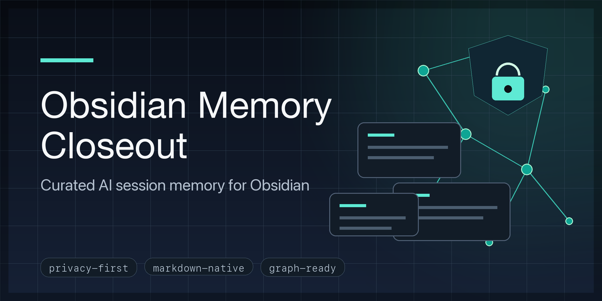

# Obsidian Memory Closeout



[](https://github.com/Nova1390/obsidian-memory-closeout/actions/workflows/validate.yml)
[](LICENSE)

Turn meaningful work into curated Obsidian memory, and read that memory before acting.

`obsidian-memory-closeout` is a privacy-first skill for using an Obsidian-compatible vault as both input and output. It helps agents query existing memory before work, ingest durable updates afterward, and keep the vault useful without storing raw transcripts, secrets, credentials, or noisy logs.

## What It Does

- Queries relevant existing notes, decisions, open loops, and references before work.
- Ingests durable updates from a session, transcript, web clip, or completed task.
- Writes concise session summaries, decisions, project updates, references, or inbox proposals.
- Lints memory quality for schema, links, privacy, stale decisions, duplication, noise, and coverage gaps.
- Reviews web clips as unreviewed inbox material before promoting them into canonical notes.
- Finds or asks for the target Obsidian vault and follows existing vault conventions first.
- Runs a local secret scan before committing or handing off.
- Refreshes Graphify or other derived indexes without treating them as the source of truth.

## Why This Exists

Raw transcripts are bad long-term memory. They are noisy, often mix durable decisions with drafting chatter, and can accidentally contain secrets or sensitive details. They are also hard to maintain because context, uncertainty, and outdated statements are difficult to separate later.

Memory also needs to be queried before work. A vault that is only written after the fact becomes an archive. A useful memory vault should inform the next action by surfacing project state, decisions, open loops, and references before the agent acts.

This skill prefers curated closeouts: decisions, session summaries, project updates, references, and proposals that preserve useful context without storing unnecessary raw material.

## Ingest / Query / Lint

The skill follows a compact operating model for LLM-readable memory vaults:

1. **Query**: read relevant notes, decisions, open loops, and references before acting.
2. **Work**: use current task context plus retrieved memory.
3. **Ingest**: convert useful sources into curated notes such as decisions, session summaries, project updates, references, or proposals.
4. **Lint**: check schema, links, privacy, stale decisions, duplicated or noisy notes, and coverage gaps.

Definitions:

- **Query**: read relevant existing memory before work.
- **Ingest**: convert useful sources into curated Obsidian notes.
- **Lint**: validate that memory remains useful, private, linked, current, and non-duplicative.

## Web Clips And Inbox Review

Browser and web clippings are source material, not canonical memory. A generic inbox convention is:

```text
00_Inbox/Web Clips/raw/
```

Raw clips should be ignored by Git and indexing by default, then reviewed for promotion into curated notes. Promote a clip only when it is durable beyond the moment, has a clear source URL/context, is privacy-safe, can be summarized without storing the full raw content, and has a clear destination note. Reject one-off reading, full article dumps, private/account data, secrets or credentials, and low-quality or duplicate sources.

Promotion criteria: durable beyond the moment, clear source URL/context, privacy-safe, summarizable without full raw content, and clear destination note.

Rejection criteria: one-off reading, full article dumps, private/account data, secrets or credentials, and low-quality or duplicate sources.

See [docs/WEB_CLIPS.md](docs/WEB_CLIPS.md) and [examples/web-clip-review.md](examples/web-clip-review.md).

## Derived Indexes And Graphify

Markdown notes remain the source of truth. Graphify or other derived indexes can be refreshed after curated notes are written, but generated graph data should not replace canonical notes.

When using Graphify, keep `.graphifyignore` privacy-aware and avoid indexing raw transcripts, private dumps, caches, and unreviewed web clips. See [docs/GRAPHIFY.md](docs/GRAPHIFY.md).

## Repository Layout

```text
.
├── skill/obsidian-memory-closeout/   # Installable Codex skill package
├── examples/                         # Sanitized example outputs
├── assets/                           # Public repository images
├── docs/                             # Graphify, web clip, release, and quality docs
├── scripts/                          # Repo validation and packaging helpers
├── .github/workflows/validate.yml     # CI validation
├── PRIVACY.md                        # Privacy model and public repo boundaries
└── README.md
```

## GitHub Social Preview

The social preview image is available at [assets/social-preview.png](assets/social-preview.png). To set it manually, open the GitHub repository settings, go to **General** -> **Social preview**, and upload that file.

## Install

### Option A: Codex Skill Installer

Ask Codex to install the skill from this GitHub directory:

```text
$skill-installer install https://github.com/Nova1390/obsidian-memory-closeout/tree/main/skill/obsidian-memory-closeout
```

Restart Codex after installation so the skill is discovered.

### Option B: Local Clone

Clone the repository, then install the skill into your local Codex skills directory:

```bash
git clone https://github.com/Nova1390/obsidian-memory-closeout.git
cd obsidian-memory-closeout
./scripts/install_local.sh
```

By default, the installer copies the skill to:

```text
~/.codex/skills/obsidian-memory-closeout
```

To install somewhere else:

```bash
CODEX_HOME=/path/to/codex ./scripts/install_local.sh
```

### Option C: Manual Copy

Copy the installable skill folder to your Codex skills directory:

```bash
cp -R skill/obsidian-memory-closeout ~/.codex/skills/obsidian-memory-closeout
```

Restart Codex after copying.

## Graphify Integration

Graphify support is optional and privacy-aware. The skill integrates with [safishamsi/graphify](https://github.com/safishamsi/graphify), treating Markdown notes as the source of truth and Graphify output as a derived index that can be refreshed after curated notes are written.

When `graphify` is installed, Codex can run:

```bash
python3 ~/.codex/skills/obsidian-memory-closeout/scripts/refresh_graphify.py /path/to/vault
```

Use `--html` if you also want a visual graph artifact:

```bash
python3 ~/.codex/skills/obsidian-memory-closeout/scripts/refresh_graphify.py /path/to/vault --html
```

The skill checks `.graphifyignore` before treating a vault as ready for indexing and should avoid indexing raw transcripts, private dumps, cache folders, and other sensitive source material. See [docs/GRAPHIFY.md](docs/GRAPHIFY.md) for setup, expected outputs, and privacy guardrails.

## Package

Create a distributable zip in `dist/`:

```bash
python3 scripts/package_skill.py
```

The package contains only the installable skill folder, not the repository docs or examples.

## Validate

Run the same checks used by CI:

```bash
python3 scripts/validate_skill.py --root .
python3 skill/obsidian-memory-closeout/scripts/secret_scan.py .
python3 scripts/package_skill.py --root . --check
```

The validation checks that:

- `SKILL.md` has valid frontmatter.
- `agents/openai.yaml` exists and matches the skill metadata shape.
- Referenced files exist.
- Graphify runtime guidance is packaged with the skill.
- Sanitized examples contain expected frontmatter.
- Packaging produces a zip with the expected skill files.
- The repository does not contain common secret-like patterns.

## Usage Prompt

After installing, ask Codex something like:

```text
Create a curated memory closeout for this session in my Obsidian vault.
```

For before-work memory lookup:

```text
Use /path/to/vault. Before working on Project Alpha, query relevant memory notes, decisions, open loops, and references. After the work, ingest durable updates and lint memory quality.
```

You can also provide a vault path explicitly:

```text
Use /path/to/vault and create a memory closeout for this transcript.
```

## Examples

See [examples/before-after.md](examples/before-after.md) for a minimal synthetic before/after showing how a noisy AI session input becomes curated Obsidian notes without storing the raw transcript.

See [examples/ingest-query-lint.md](examples/ingest-query-lint.md) for the full generic workflow: query existing memory, do the work, ingest durable updates, then lint memory quality.

## Privacy

This repository does not include private vault content. The included examples are synthetic and sanitized. See [PRIVACY.md](PRIVACY.md) for the intended privacy boundaries and review checklist.

## Contributing

Issues and pull requests are welcome. Please read [CONTRIBUTING.md](CONTRIBUTING.md) and keep all examples synthetic. Security or privacy concerns should follow [SECURITY.md](SECURITY.md).

## License

MIT. See [LICENSE](LICENSE).
